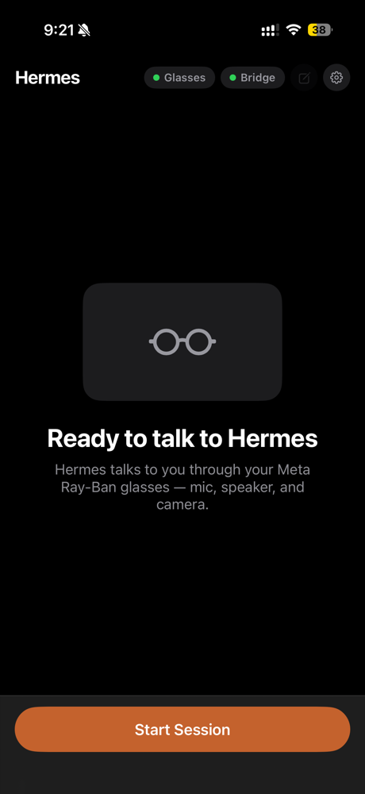
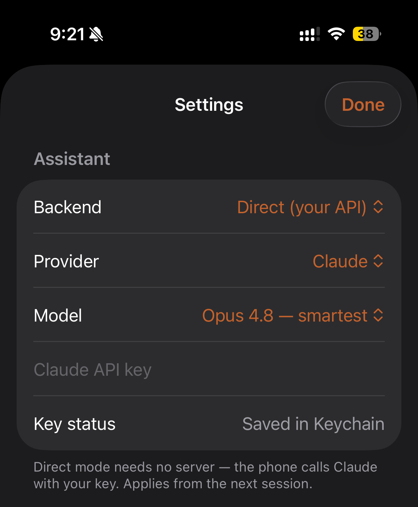
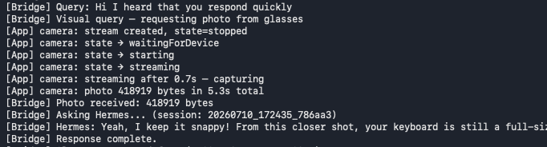

# Hermes Glasses

Talk to your own AI through Meta Ray-Ban smart glasses — hands-free voice
conversations with live on-device transcription, and computer vision through the
glasses camera ("what am I looking at?"). Bring your own API key for a
zero-infrastructure setup, or point it at a Hermes Agent for full agentic,
tool-using conversations.

Part of the **Sidekick** project.

## Demo

<p align="center">
  
  &nbsp;&nbsp;
  
</p>
<p align="center"><em>On the Ray-Ban Display lens — a spoken reply (left) and live transcription (right), fully hands-free.</em></p>

<p align="center">
  
  &nbsp;&nbsp;&nbsp;
  
</p>
<p align="center"><em>Home (glasses + bridge connected) and “Direct (your API)” — pick a provider, paste your key.</em></p>

<p align="center">
  
</p>
<p align="center"><em>Bridge mode: a visual query captures a glasses photo and answers in ~5&nbsp;s.</em></p>

## What it does

- 🎙️ **Live transcription** — your words appear on screen as you speak, using
  Apple's on-device speech recognition (no audio leaves the phone for STT)
- 🤖 **Ask anything** — finished utterances go straight to your chosen AI
  provider (Direct mode) or to a Hermes Agent running on your Mac (bridge
  mode), and the answer is spoken back through text-to-speech
- 👓 **Vision through the glasses** — say "what am I looking at?" and the app
  captures a photo from the Ray-Ban camera and the AI answers about the image
- 🧪 **Built-in test panel** — Bridge / Photo / Query / Visual buttons verify
  each subsystem independently, with a live mic level meter

## Architecture

There are two runtime paths. **Direct (your API)** needs no server — the phone
calls your provider itself:

```
┌─────────────┐   Bluetooth    ┌──────────────┐     HTTPS      ┌─────────────────────┐
│  Ray-Ban    │ ─────────────▶ │  iPhone app  │ ─────────────▶ │  Your AI provider   │
│  glasses    │  (DAT SDK:     │  (SwiftUI)   │  query +       │  Claude · OpenAI ·  │
│             │   camera)      │  on-device   │  base64 photo  │  Gemini · Ollama    │
└─────────────┘                │  STT + TTS   │ ◀───────────── │                     │
                               └──────────────┘   reply text   └─────────────────────┘
```

**Hermes agent (bridge)** routes through a Mac running the agent (tools +
memory), over a WebSocket:

```
┌─────────────┐   Bluetooth    ┌──────────────┐    WebSocket     ┌──────────────────┐
│  Ray-Ban    │ ─────────────▶ │  iPhone app  │ ───────────────▶ │  Mac bridge      │
│  glasses    │  (DAT SDK:     │  (SwiftUI)   │  text queries +  │  (Python)        │
│             │   camera)      │              │  base64 photos   │                  │
└─────────────┘                │  on-device   │ ◀─────────────── │  hermes chat CLI │
                               │  live STT    │  responses + TTS │  + edge-tts      │
                               └──────────────┘    (PCM 24 kHz)  └──────────────────┘
```

- **iOS app** (`HermesGlasses/`) — SwiftUI app using the
  [Meta Wearables Device Access Toolkit](https://github.com/facebook/meta-wearables-dat-ios)
  0.8.0 for glasses registration, sessions, and camera capture, plus
  `SFSpeechRecognizer` for live on-device transcription. In Direct mode,
  `HermesGlasses/Services/Providers/` calls the provider API directly; in
  bridge mode, `HermesAPIClient` talks to the Mac bridge over WebSocket.
- **Bridge** (`bridge/hermes_bridge.py`) — a small Python WebSocket server on
  the Mac. Receives text queries, detects visual questions by keyword, requests
  a photo from the app when needed, invokes `hermes chat -q ... [--image ...]`
  (or calls a provider API directly), and streams back the reply text plus TTS
  audio (Edge TTS with macOS `say` fallback).

### WebSocket protocol (app ⇄ bridge, port 8765)

Only used in **Hermes agent (bridge)** mode — Direct mode never opens this
connection.

| Direction | Message | Meaning |
|---|---|---|
| app → bridge | `{"type":"query","text":...}` | Transcribed utterance (STT is on-device) |
| bridge → app | `{"type":"capture_photo"}` | Take a photo with the glasses now |
| app → bridge | `{"type":"photo","data":"<base64 jpeg>"}` | Captured photo |
| app → bridge | `{"type":"photo_error","message":...}` | Capture failed — answer text-only |
| bridge → app | `{"type":"response","text":...}` | Hermes's answer |
| bridge → app | `audio_start` / binary PCM16 24 kHz / `audio_end` | Spoken reply |

Binary frames from the app are reserved for mic audio (legacy server-side STT
path, still supported by the bridge). The bridge's `HERMES_BRIDGE_BRAIN` env
var now supports `anthropic` / `openai` / `gemini` (direct provider call) in
addition to the default `hermes` (agentic CLI with tools + memory).

## Setup

### Requirements

- iPhone with iOS 17+, Xcode 16+
- Meta Ray-Ban glasses paired with the Meta AI app
- A **Meta App ID + Client Token** for the glasses SDK, from the
  [Meta Wearables Developer Center](https://wearables.developer.meta.com/)
  (create a project → Configuration → the *Application ID* section
  auto-generates them). Copy `Config/Secrets.example.xcconfig` to
  `Config/Secrets.xcconfig` (gitignored) and fill in `META_APP_ID` /
  `CLIENT_TOKEN` — they're injected into `Info.plist`'s `MWDAT` dict at build
  time, so nothing sensitive is committed. In the Developer Center also
  register your app's **Bundle ID** (Meta rejects hyphens) and **Team ID**.
  See the [iOS DAT integration docs](https://wearables.developer.meta.com/docs/develop/dat/build-integration-ios/).
- **Path A (Direct):** an API key from your chosen provider — nothing else.
- **Path B (Hermes bridge):** additionally, macOS with Python 3.11+ and a
  working Hermes Agent install (`hermes chat` on PATH).

Pick one of the two paths below — you don't need both.

### Path A — Direct (your API), zero infrastructure

Build the app to your iPhone, then in the app go to
**Settings → Assistant → Backend: Direct (your API)**, pick a **Provider**
(Claude / OpenAI / Gemini / Local (Ollama)), paste your API key (or set a
**Base URL** instead, for Ollama or an OpenAI-compatible proxy), pick a
**Model**, and start talking. No Mac, no bridge — everything runs from the
phone, and keys are stored in the iPhone Keychain, one per provider.

1. Open `HermesGlasses.xcodeproj`, set your signing team, build to your iPhone.
2. In the app: **Connect Glasses** → complete registration in the Meta AI app.
3. **Settings → Assistant → Backend: Direct (your API)** → choose a Provider,
   Model, and paste your key.
4. Start a session. First run prompts for microphone + speech recognition
   permissions; the first photo prompts for **camera permission via Meta AI**
   (tap the Photo test button to trigger the grant flow).

### Path B — Hermes agent (bridge), full agentic assistant

For tool use and cross-turn memory, run a [Hermes Agent](https://hermes-agent.nousresearch.com)
on your Mac and point the app at it over WebSocket.

1. Install Hermes:
   ```bash
   curl -fsSL https://hermes-agent.nousresearch.com/install.sh | bash
   ```
   (or use the desktop installer — see the
   [installation docs](https://hermes-agent.nousresearch.com/docs/getting-started/installation)).
   This puts the `hermes` CLI on your PATH.
2. Run the bridge:
   ```bash
   cd bridge
   pip install websockets edge-tts
   python hermes_bridge.py
   # → listens on ws://0.0.0.0:8765/voice
   ```
   Copy `bridge/.env.example` to `bridge/.env` to configure it — in
   particular, `HERMES_BRIDGE_TOKEN` is **required** if the bridge is
   reachable from the internet (clients then connect with
   `ws://host:8765/voice?token=<value>`).
3. In the app: build to your iPhone, **Connect Glasses**, then
   **Settings → Assistant → Backend: Bridge (server)** and set the endpoint
   to `ws://<your-mac-ip>:8765/voice`. The "Bridge" chip in the banner turns
   green when the bridge is reachable.

The bridge's `HERMES_BRIDGE_BRAIN` env var can also be set to `anthropic`,
`openai`, or `gemini` to skip the Hermes CLI and call that provider's API
directly from the bridge — but **those direct-provider brains are
single-turn only (no conversation memory)**; use the default `hermes` brain
for cross-turn history and tool access. If you do use a direct-provider
brain, make sure `HERMES_BRIDGE_MODEL` matches the chosen brain's provider
(e.g. a Claude model id only works with `anthropic`, an OpenAI model id only
works with `openai`).

### Comparison

| | Direct (your API) | Hermes agent (bridge) |
|---|---|---|
| Infra needed | none — just the app | a Mac running the bridge + Hermes |
| Providers | Claude, OpenAI, Gemini, local (Ollama) | Hermes agent (or bridge-side provider) |
| Tools / agentic | no | yes |
| Vision | yes | yes |
| Keys live in | iPhone Keychain | bridge environment |

## Testing

Use the built-in test panel (visible while a session is active):

| Button | Verifies |
|---|---|
| Bridge | WebSocket connectivity + welcome handshake |
| Photo | Glasses camera capture alone (also runs the permission grant) |
| Query | Bridge → Hermes → response → TTS round trip |
| Visual | Full photo + vision pipeline |

Bridge-side unit tests:

```bash
cd bridge && python -m unittest test_hermes_bridge -v
```

See [`CONTRIBUTING.md`](CONTRIBUTING.md) for the standalone Swift provider
test suite and the full build/test workflow.

## Project layout

```
HermesGlasses/
├── Services/
│   ├── HermesSpeechRecognizer.swift   # on-device live STT
│   ├── HermesAudioManager.swift       # mic capture + TTS playback
│   ├── HermesCameraManager.swift      # glasses photo capture (DAT camera)
│   ├── HermesAPIClient.swift          # WebSocket client (bridge mode)
│   └── Providers/                     # AIProvider seam for Direct mode
│       ├── AIProvider.swift
│       ├── AnthropicProvider.swift
│       ├── OpenAICompatibleProvider.swift
│       └── GeminiProvider.swift
├── ViewModels/                        # session orchestration, registration
└── Views/                             # SwiftUI UI + test panel
bridge/
├── hermes_bridge.py                   # WebSocket bridge on the Mac
├── .env.example                       # bridge configuration template
└── test_hermes_bridge.py              # unit tests
tests/                                 # standalone swiftc test suites
docs/superpowers/                      # design specs and implementation plans
```

## Status / known limitations

- Voice loop and vision loop are working end-to-end on device, in both
  Direct and bridge modes.
- The microphone currently used is the **iPhone's** — routing audio through
  the glasses microphone is the next milestone.
- Glasses photos may arrive rotated (EXIF orientation not yet normalized).
- Visual-query detection is keyword-based ("look", "what is this", …).
